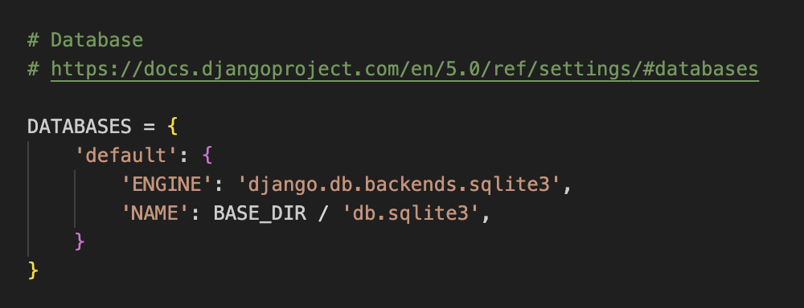
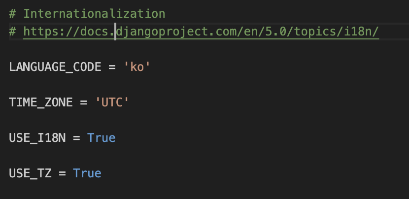
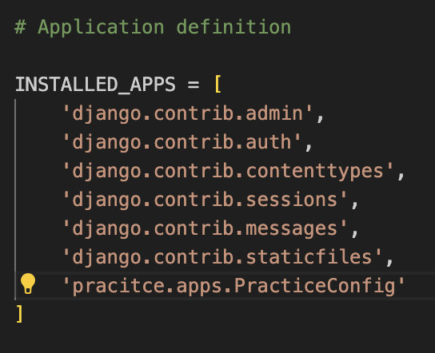

## django
* 쟝고 주피터로는 개발하기 불편
* 파이챰으로 많이 사용
* django는 웹 프레임워크
* django에서는 웹 사이트에 대한 전체 프로그램을 Proejct라고 부른다.

#### django의 특징
* MVC 패턴 기반 MVT
    - (데이터)화면에 해당하는 데이터의 DB를 액세스할 수 있는 Model
    - (모델)데이터를 가져오고 변형할 수 있는 View
    - (화면)화면을 담당하는 Template
* 객체 관계 매핑
    - ORM 기능 제공
    - DB TABLE을 CLASS 함수로 선언
* 빠른 개발 및 배포
* 신문 기사를 업데이트할 목적으로 만들었다고 한다

## 가상환경 구축 및 django 시작하기
#### 파이썬 기반 가상환경의 종류
1. vertualenv
- python module
- 현재 설치된 파이썬 버전을 따라감
```
# 파이썬 가상환경 생성 명령어
python -m virtualenv venv

# 폴더 생성
mkdir venv

# 가상환경 시작하기
source ./venv/bin/activate 

# 가상환경 내 파이썬 위치 조회 명령어
which python 

# 새로운 프로젝트 시작 명령어
django-admin startproject 생성할 폴더명

# 가상 서버 내에서 내장 개발 서버를 실행하는 명령어
python manage.py runserver

# 웹페이지를 구동하기 위해서는 DB가 필요한데 migate를 통해서 세팅해준다
python manage.py migrate

# app 생성
python manage.py startapp 폴더명
```

#### 만들어진 폴더 내 파일 중에서..
- db.sqlite3 : 내장DB
    - DB Browser for SQLite 프로그램을 통해서 내장 DB를 읽어올 수 있다.
- settings : 환경설정파일
    * DB 위치값 설정하는 곳
    

    * 언어 변경하는 곳
    

#### 세팅
1. class 함수명을 settings 폴더 내 application definition에 등록해준다.
    * 어플리케이션 등록하기
    
2. urls.py 파일에 path 등록
    * path('Hello/', )
3. view.py 파일에 로직 작성
    * 로직작성
    * from django.http import HttpResponse 라이브러리를 사용해서 실제 html로 전환
4. urls.py 파일에 등록한 패스 내에 인자를 넣어줌
    * path('Hello/', views.TellHello)
5. urls.py 파일에 사용자 함수 불러오기
    * from practice import views
    
#### 쟝고의 기본 명령어
* startapp
* makemigrations
    - class 내 변수 > SQL 언어로 변환 해준다.
* sqlmigrate
* migrate
    - makemigrations 한 것을 실제로 적용해준다.
* showmigrations 
* runserver

2. conda 
 - anaconda, miniconda를 설치해야 사용 가능 
 - conda -> 32bit 환경 세팅 가능 
